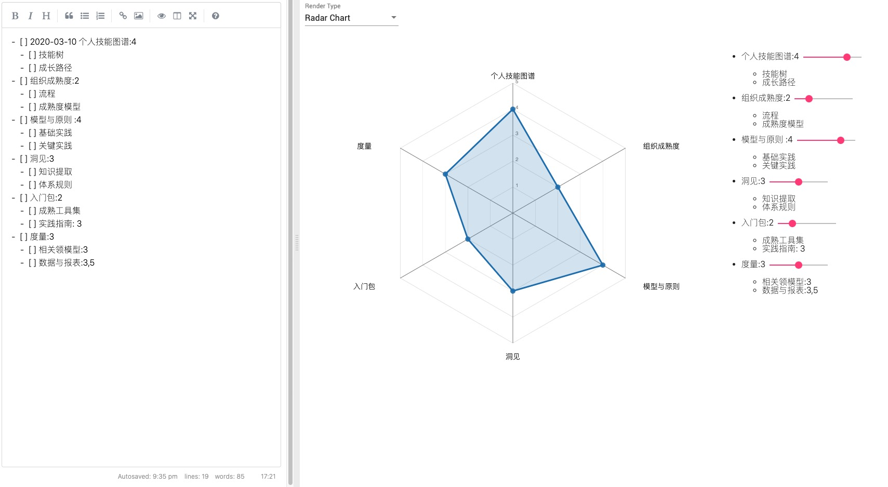

# PowerMD

PowerMD is a new markdown tool for Phodal's wrok.

Features:

 - markdown list DSL
   - [x] mindset
   - [x] todo list
   - [ ] markdown list DSL JSON
   - [ ] markdown list DSL RadarChart (with checklist)
   - [x] markdown list DSL RadarChart (with rating)
   - [ ] kanban
   - [ ] calendar
   - [ ] radial tidy tree (aka, skill tree)
 - markdown table DSL
   - [ ] to chart
 - other
   - [ ] hexbin (capable)
   
# Screenshots

Markdown to Mindset

Markdown to Todo List

Markdown to RadarChart

License
---

@ 2020 A [Phodal Huang](https://www.phodal.com)'s [Idea](http://github.com/phodal/ideas).  This code is distributed under the MPL license. See `LICENSE` in this directory.
