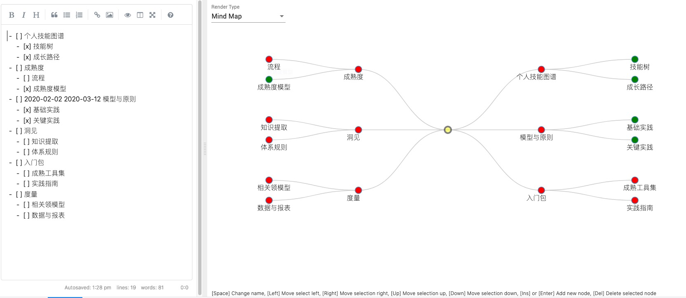
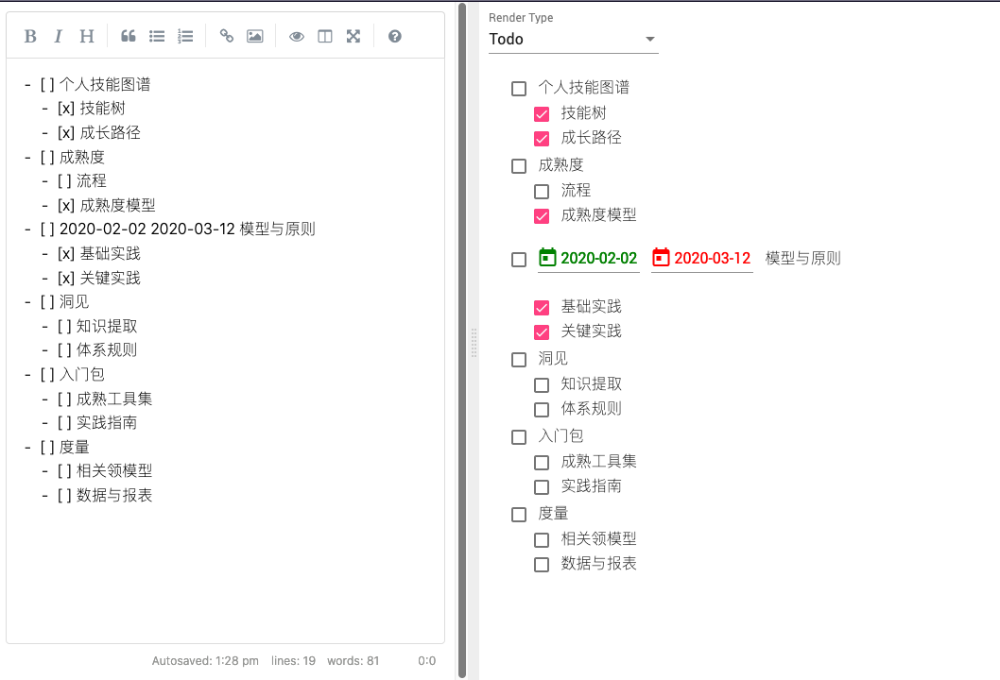

# PowerMD

PowerMD is a new markdown tool for Phodal's wrok.

Features:

 - [x] markdown to mindset
 - [x] markdown to todo list
 - [ ] markdown to Checklist
 - [ ] markdown to RadarChart (with checklist)
 - [ ] markdown to RadarChart (with rating)

# Screenshots

Markdown to Mindset

Markdown to Todo List

License
---

@ 2020 A [Phodal Huang](https://www.phodal.com)'s [Idea](http://github.com/phodal/ideas).  This code is distributed under the MPL license. See `LICENSE` in this directory.
